# RIO Website — Sơ Đồ Kiến Trúc Chi Tiết

> Các sơ đồ mô tả mã nguồn hiện tại. Nguồn chính: `src/app`, `src/components`, `src/lib`, `next.config.mjs`.

## 1. Bản đồ tổng thể hệ thống

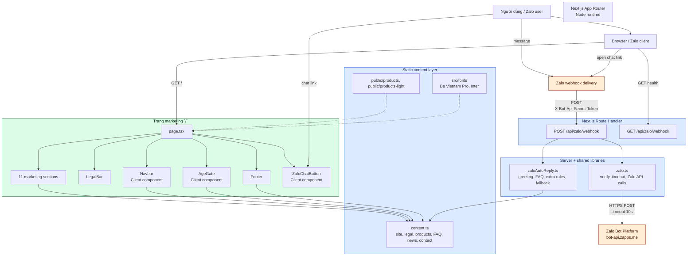

## 2. Cấu trúc server và client trong Next.js

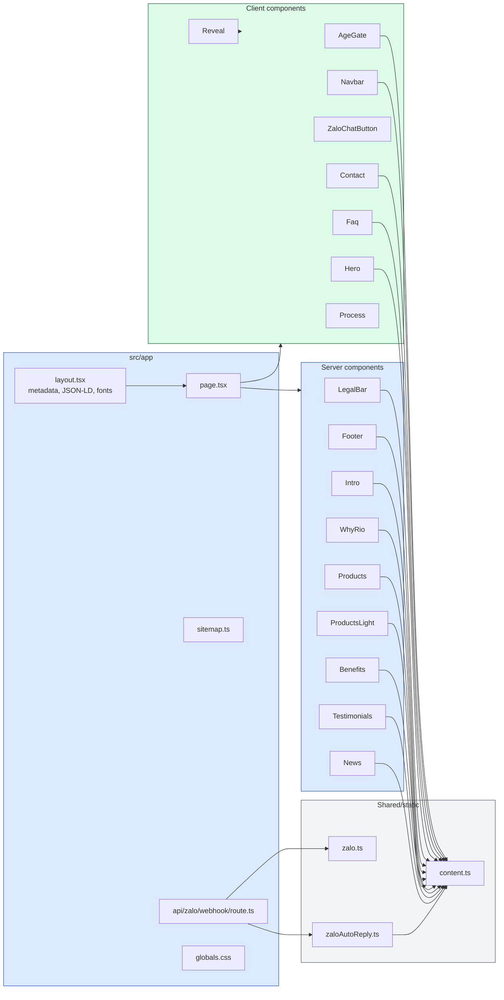

## 3. Luồng request trang marketing

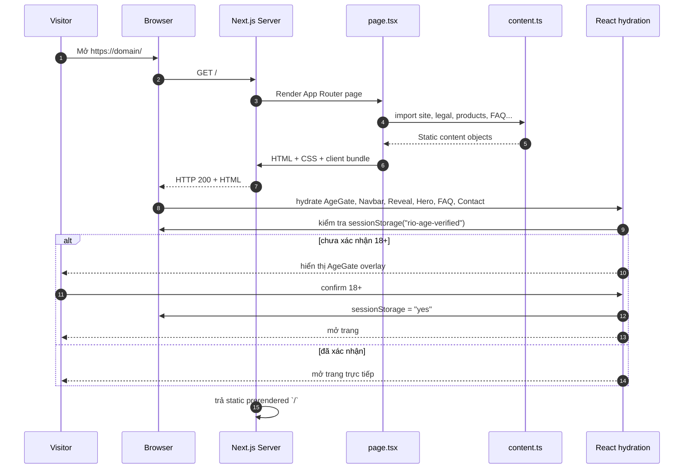

## 4. Luồng navigation và cấu trúc trang

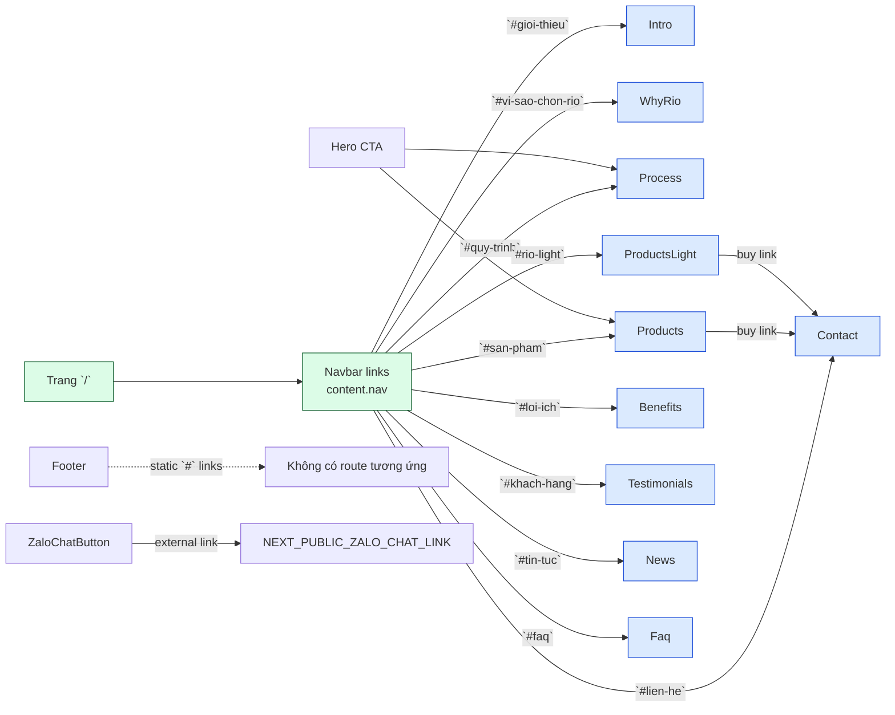

## 5. Luồng xác thực tuổi client-side

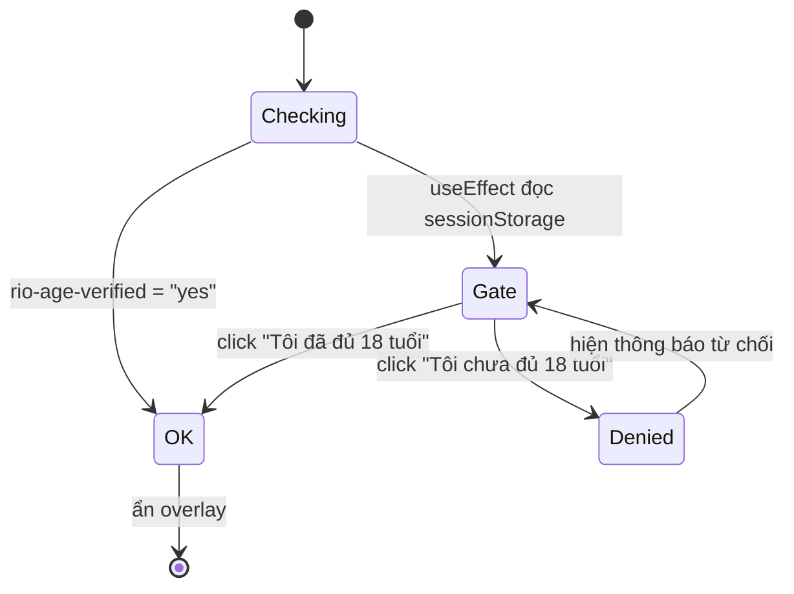

## 6. Kiến trúc API và xác thực webhook

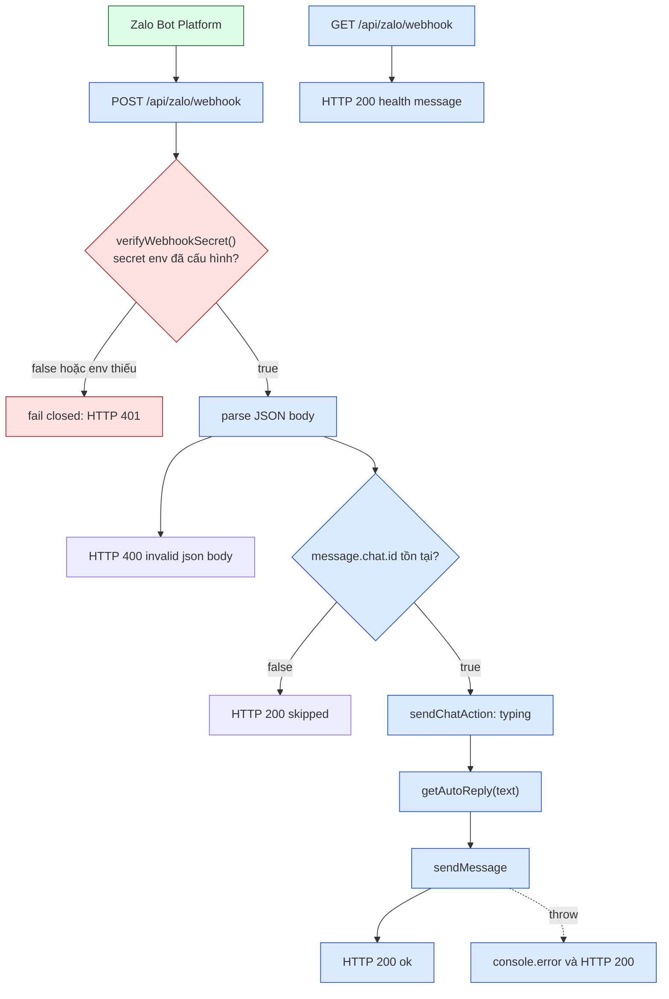

## 7. Luồng xử lý tin nhắn Zalo end-to-end

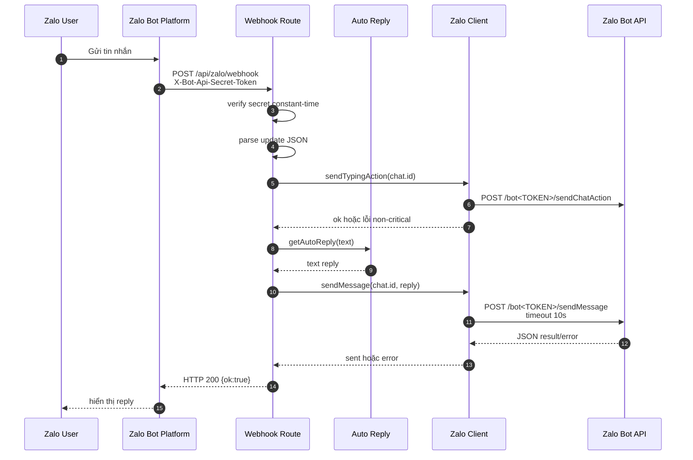

## 8. Logic auto-reply rule-based

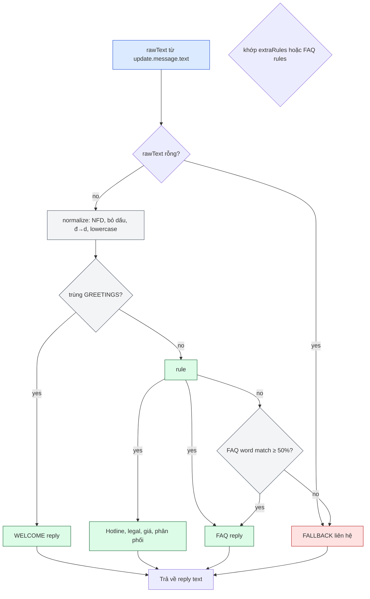

## 9. Ma trận tích hợp và kết nối dịch vụ

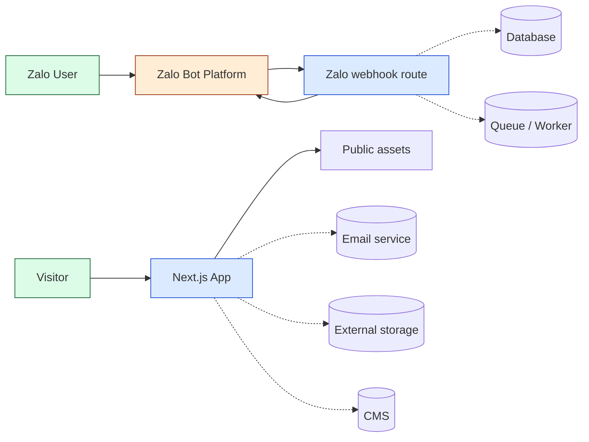

## 10. Cấu hình, biến môi trường và deployment

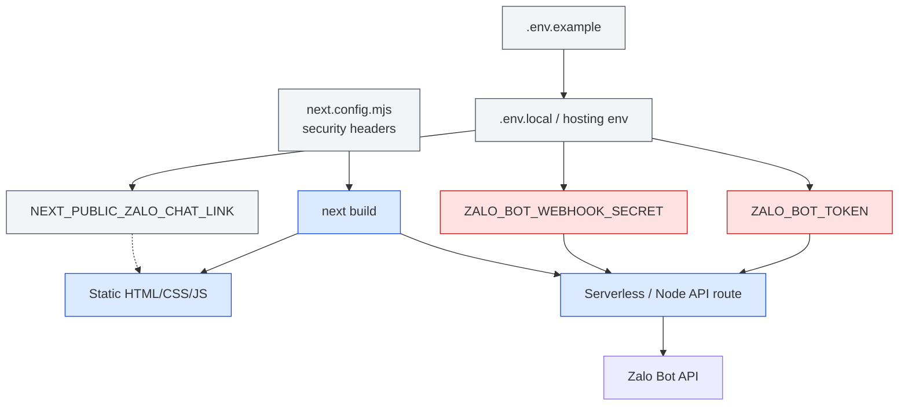

## 11. Sơ đồ dữ liệu nội bộ

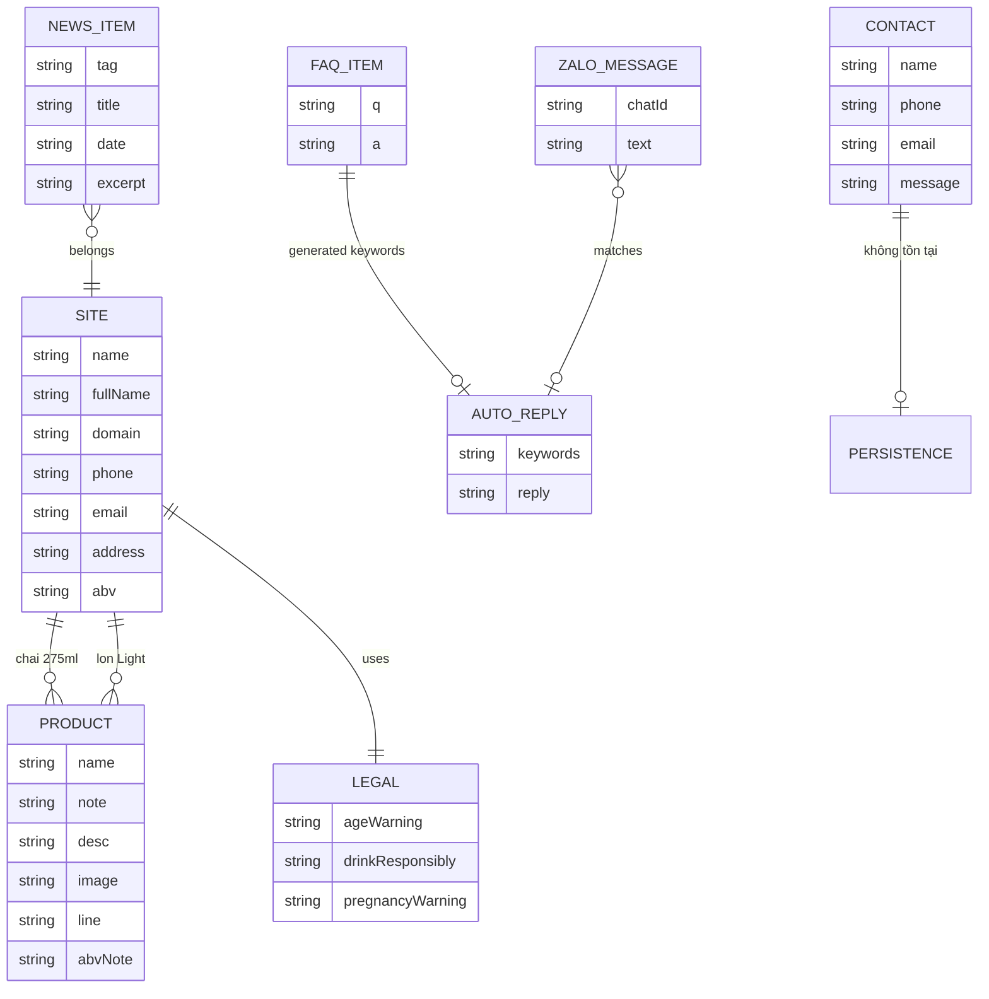

## 12. Deployment và CI/CD hiện trạng

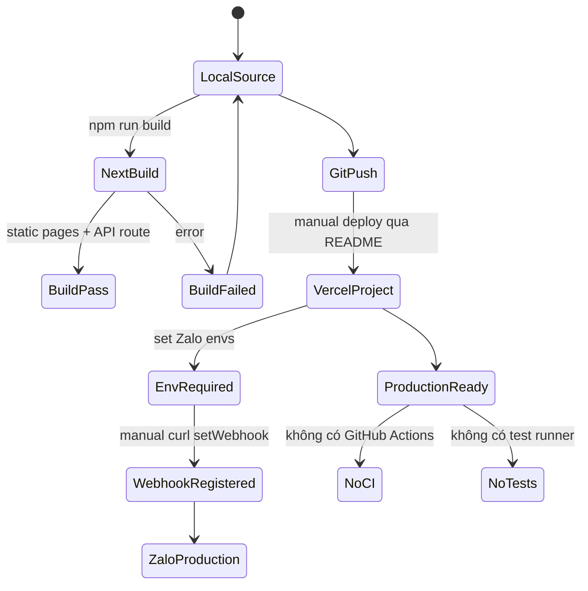

## 13. Luồng bảo mật webhook

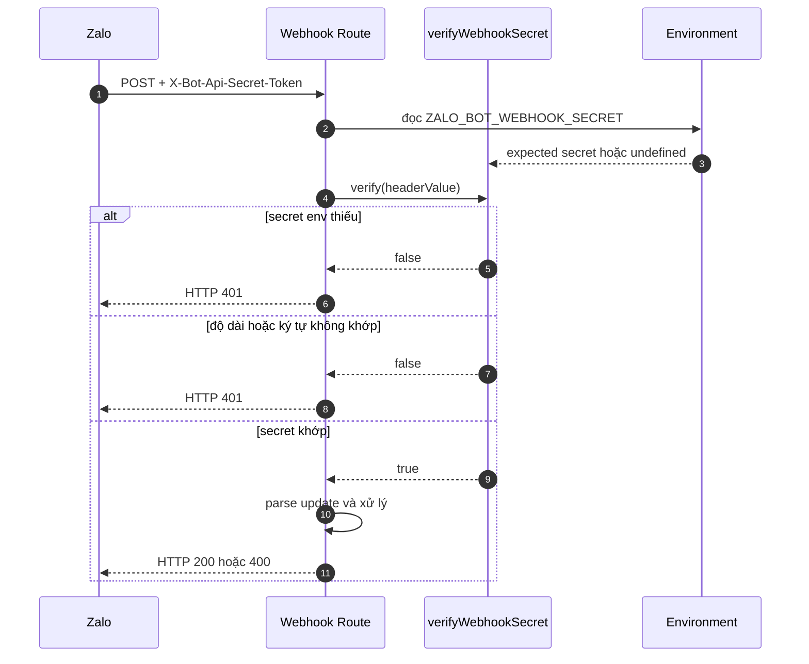

## 14. Luồng sitemap và SEO

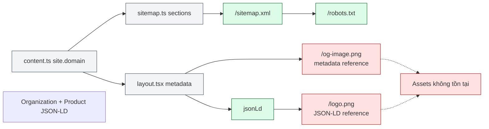

## 15. Map kết nối component-to-content

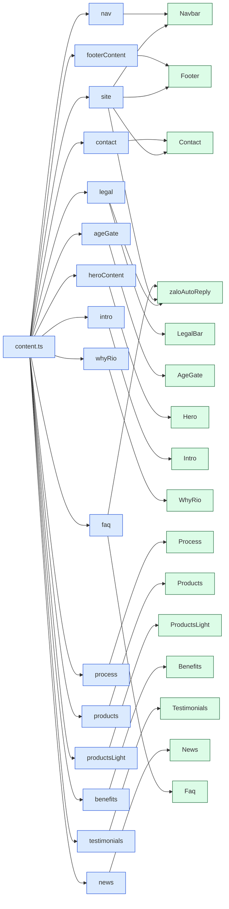
